# SafeRide System Design

> Last updated: 2026-07-19. Diagrams are [Mermaid](https://mermaid.js.org/) — they render on GitHub and in VS Code preview (with the Mermaid extension).

## 1. Overview

SafeRide is a local full-stack computer vision web application for detecting motorcycle helmet violations in traffic video. It accepts uploaded videos and live webcam/RTSP feeds, runs a three-model YOLO detection pipeline with rider tracking and helmet-status voting, captures evidence images, reads Thai license plates with specialized OCR, and lets human reviewers inspect and judge every saved violation through a browser UI.

The system is designed for a senior-project MVP and local demo workflow. It prioritizes a working end-to-end pipeline, explainable review screens, measurable accuracy (offline eval harness + live review metrics), and local file/database persistence over distributed scale or production security.

### Goals

- Accept uploaded traffic videos from a browser and live webcam/RTSP sources.
- Process video with YOLO-based object, helmet, and plate detection on GPU when available.
- Detect no-helmet motorcycle riders (drivers **and** passengers) and save reviewable evidence.
- Attach the correct license plate to each violator and read it with Thai-specialized OCR.
- Preserve original video playback with synchronized detection overlays.
- Show processing progress, elapsed time, FPS, and ETA during analysis.
- Allow runtime tuning of detection thresholds for subsequent analyses.
- Persist jobs, violations, evidence frames, plate crops, and detection metadata locally.
- Measure accuracy: offline event-level eval harness and live human-review precision metrics.
- Improve the specialist models by fine-tuning on locally labeled footage (two rounds completed).

### Non-Goals

- Multi-user authentication or role-based access.
- Cloud deployment, horizontal scaling, or distributed workers.
- Production-grade audit logging or retention policies.
- Multi-camera simultaneous live sessions (single live session at a time).

## 2. High-Level Architecture

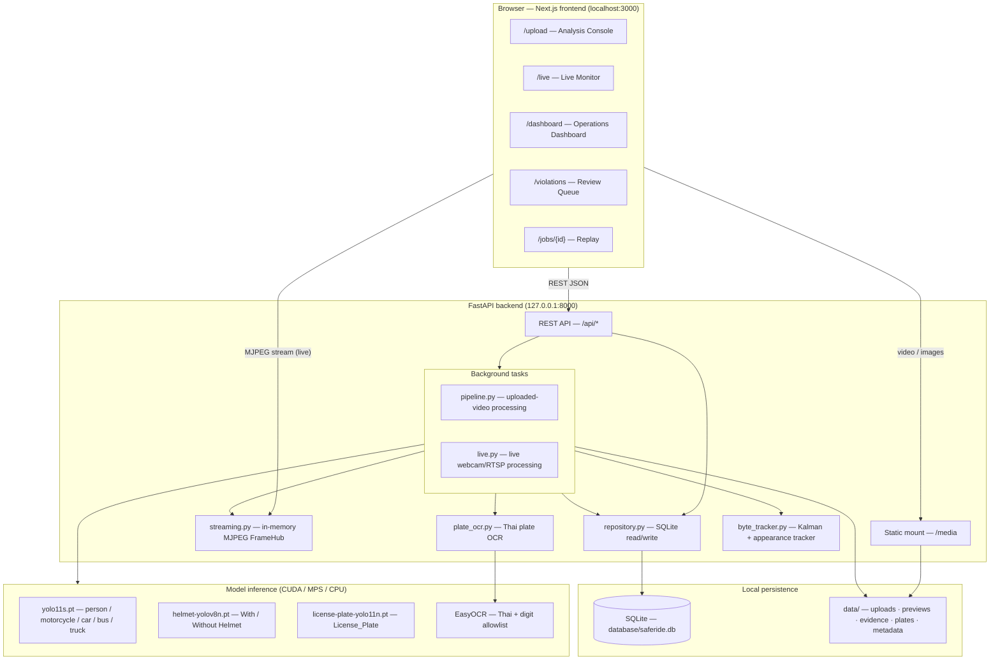

Two processing paths share the same detection/tracking/violation core:

| Path | Entry | Frame source | Sampling | Recording |
|---|---|---|---|---|
| Upload | `POST /api/videos/upload` | Decoded video file | Frame-index based | Original file kept |
| Live | `POST /api/live/start` | Webcam index or RTSP URL | Wall-clock based | Every frame re-encoded to MP4 |

## 3. Repository Layout

```text
SafeRide/
  backend/
    app/
      main.py                 FastAPI app, CORS, /media mount, DB init
      api/routes.py           All REST endpoints
      core/config.py          Pydantic settings (env-overridable)
      core/database.py        SQLite schema + column migrations
      schemas/models.py       Pydantic API models
      services/
        pipeline.py           Uploaded-video pipeline (detection, association, saving)
        live.py               Live webcam/RTSP pipeline
        byte_tracker.py       ByteTrack-style tracker (Kalman + HSV appearance)
        plate_ocr.py          Thai plate OCR (allowlist, recombination, voting)
        repository.py         SQLite helpers + review metrics
        storage.py            Upload saving, media deletion (root-restricted)
        streaming.py          MJPEG FrameHub (viewer-counted)
    requirements.txt          FastAPI stack
    requirements-ml.txt       Torch / Ultralytics / EasyOCR stack
  frontend/
    app/                      Next.js App Router pages (upload, live, dashboard, violations, jobs/[id])
    components/               UploadClient, LiveClient, DashboardClient, ViolationsClient, ReplayClient, AppShell, StatCard
    lib/api.ts                API client + shared types
  models/                     Deployed model weights (git-ignored binaries)
  training/                   Isolated fine-tuning workspace (prepare_dataset.py, datasets/, runs/)
  train-data/  train-data2/   Label Studio YOLO exports (111 + 214 frames)
  scripts/
    evaluate.py               Offline event-level eval harness
    backfill_plate_ocr.py     Re-run OCR over saved plate crops
  data/                       Generated media (uploads, previews, evidence, plates, metadata)
  database/saferide.db        SQLite database
  docs/                       This file, training reports, confidence guide, telemetry math
  presentation/               HTML slide decks (system, training)
```

## 4. Runtime Components

### 4.1 Frontend

Next.js + React + TypeScript; all styling in `frontend/app/globals.css`.

| Route | Component | Purpose |
|---|---|---|
| `/upload` | `UploadClient.tsx` | Analysis Console: upload, playback + canvas overlays, runtime settings, telemetry, results & evidence tabs |
| `/live` | `LiveClient.tsx` | Live Monitor: webcam/RTSP source picker, Go Live/Stop, annotated MJPEG stream, session telemetry, latest evidence, replay link |
| `/dashboard` | `DashboardClient.tsx` | Job history, evidence feed, reopen saved playback |
| `/violations` | `ViolationsClient.tsx` | Review Queue: violation table, plate/evidence inspector, review decisions, CSV export |
| `/jobs/{jobId}` | `ReplayClient.tsx` | Completed-job replay with synchronized overlays and jump-to-violation |

`frontend/lib/api.ts` holds the API client and shared types; `AppShell.tsx` is the shared navigation shell.

### 4.2 Backend

FastAPI + SQLite + OpenCV + Ultralytics YOLO + EasyOCR. Uploaded-video jobs and live sessions run as FastAPI background tasks in the same process; models are loaded lazily once per process and reused.

### 4.3 Inference device selection

`model_device = "auto"` (default) is resolved once per process:

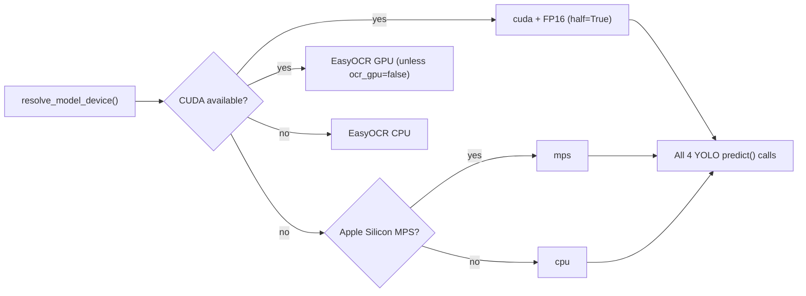

`ocr_gpu` is `bool | None`: unset means "GPU when CUDA exists" (EasyOCR's GPU path is CUDA-only, so Macs stay on CPU). On the dev machine (RTX 4070 SUPER, torch 2.12 + cu130) the benchmark clip processes in ~27 s wall clock while analyzing more frames than CPU runs — adaptive dense windows become essentially free; remaining wall-clock cost is video decode and OCR.

## 5. API Design

Base URL: `http://127.0.0.1:8000/api`. Generated media is served from `http://127.0.0.1:8000/media/...`.

| Method | Path | Purpose |
|---|---|---|
| GET | `/health` | Backend availability |
| GET / PATCH | `/settings` | Read / update runtime detection settings (in-memory) |
| POST | `/videos/upload` | Multipart video upload → creates job, starts background processing |
| POST | `/live/start` | Start live session (`{"source": "0"}` or `{"source": "rtsp://..."}`) |
| POST | `/live/{job_id}/stop` | Request live session stop |
| GET | `/jobs` | List jobs |
| GET | `/jobs/{job_id}` | Job detail + telemetry |
| DELETE | `/jobs` / `/jobs/{job_id}` | Delete all / one job incl. media |
| GET | `/jobs/{job_id}/stream` | MJPEG annotated stream (viewer-counted) |
| GET | `/jobs/{job_id}/detections` | Sampled-frame detection metadata JSON |
| GET | `/metrics/review` | Human-review precision metrics |
| GET | `/violations?limit=` | List violations |
| DELETE | `/violations/{id}` | Delete violation incl. media |
| PATCH | `/violations/{id}/review` | Set `pending` / `confirmed` / `false_positive` |

### Runtime settings

`PATCH /api/settings` updates six bounded (Pydantic-validated) values in backend process memory: `object_confidence`, `helmet_confidence`, `plate_confidence`, `sample_every_seconds`, `max_violations_per_video`, `enable_ocr`. They apply to **subsequent** jobs and reset to `.env`/defaults on backend restart. The UI disables the panel while a job is active.

### Upload sequence

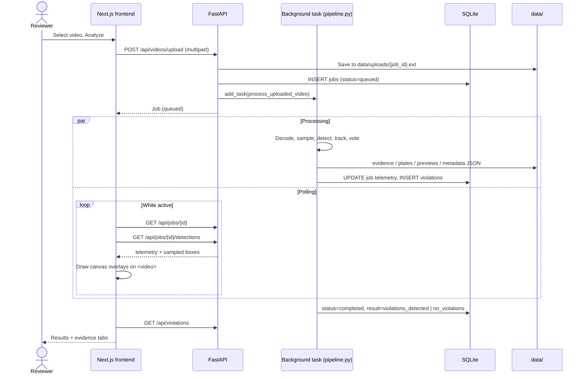

### Live ingestion

`POST /api/live/start` creates a live job that runs the same detection/tracking/violation core in real time:

- Wall-clock based sampling (adaptive densification kept, time-based).
- Every frame recorded to `data/uploads/{job_id}.mp4` — H.264 (`avc1`) when an encoder is available, `mp4v` fallback (some browsers cannot play `mp4v` inline) — so completed sessions replay exactly like uploaded jobs.
- Annotated frames publish to the MJPEG hub only while someone is watching.
- RTSP credentials are stripped from the stored job name. Webcams open with `CAP_DSHOW` on Windows for fast init.
- Progress/ETA stay at zero while running (total length unknown).

Session end conditions: operator stop, source loss (60 consecutive read failures), per-session violation cap, or the `live_max_seconds` safety limit (default 900 s).

### Job lifecycle

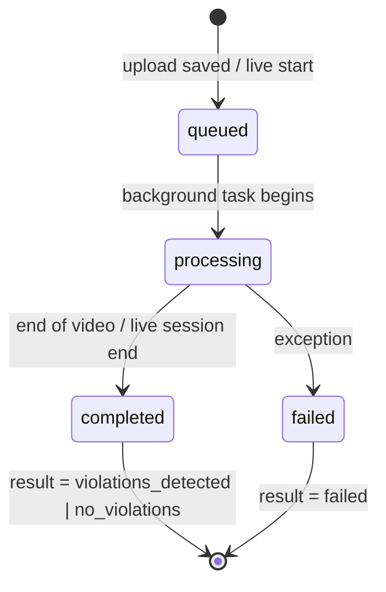

Job `status`: `queued` → `processing` → `completed` | `failed`. Job `result`: `processing` → `violations_detected` | `no_violations` | `failed`.

### Review metrics

`GET /api/metrics/review` aggregates human review decisions into precision metrics — `overall`, per `jobs`, and per `confidence_bands` (helmet confidence buckets `under_50`, `50_to_65`, `65_to_80`, `80_plus`). Each bucket reports total / pending / confirmed / false_positive counts and precision = `confirmed / (confirmed + false_positive)` (`null` until at least one record is reviewed).

## 6. Data Model

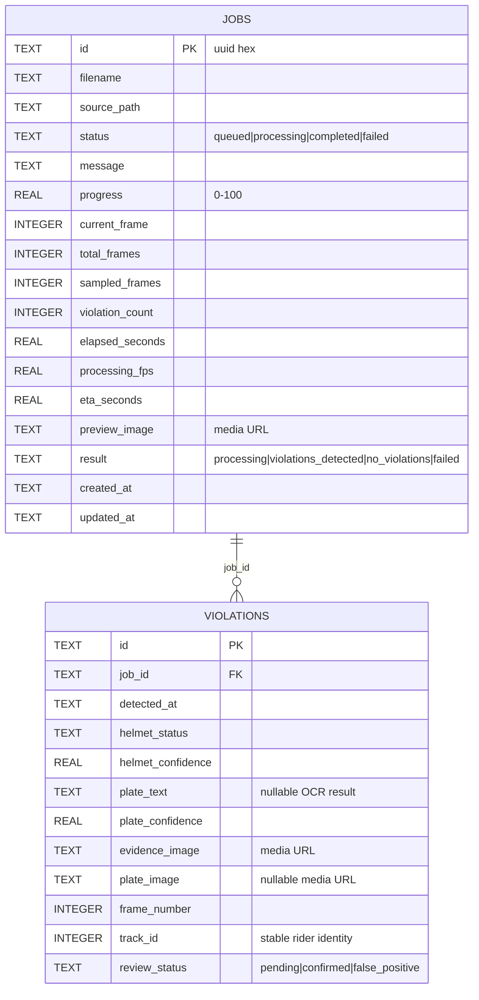

Schema lives in `backend/app/core/database.py`; missing columns are added via `PRAGMA table_info` + `ALTER TABLE` migrations at startup, so old databases upgrade in place.

### Filesystem storage

```text
data/
  uploads/      Original uploaded videos + live session MP4 recordings
  previews/     Latest annotated preview image per job
  evidence/     Saved violation evidence frames (annotated, with association guides)
  plates/       Saved license plate crops
  metadata/     {job_id}_detections.json — sampled-frame detection metadata

models/
  yolo11s.pt                 COCO YOLO11s (person, motorcycle, car, bus, truck)
  helmet-yolov8n.pt          Helmet detector baseline (HF iam-tsr/yolov8n-helmet-detection)
  license-plate-yolo11n.pt   Plate detector baseline (HF morsetechlab/yolov11-license-plate-detection)

training/runs/               Fine-tuned candidate weights (helmet-v1/v2, plate-v1/v2) — staged, not yet promoted
.cache/                      Ultralytics + EasyOCR caches
```

Model weights are git-ignored large binaries. YOLO/Ultralytics models are AGPL-3.0 — fine for a school project, cite sources in the report.

## 7. Video Processing Pipeline

### 7.1 End-to-end flow

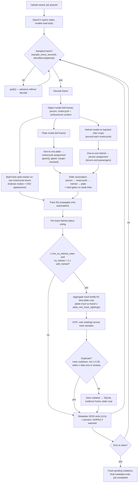

Processing runs at full hardware speed by default. Real-time pacing applies only while an MJPEG stream viewer is connected or `REALTIME_PREVIEW=true`. When nobody watches, MJPEG JPEG encoding is skipped entirely.

### 7.2 Model roles

| Model | Weights | Classes used | Input |
|---|---|---|---|
| General object detector | `yolo11s.pt` (COCO) | `person`, `motorcycle`; `car`/`bus`/`truck` as negative plate context | Full frame @ `object_imgsz` 960 |
| Helmet detector | `helmet-yolov8n.pt` | `With Helmet`, `Without Helmet` | Batched rider crops @ `helmet_crop_imgsz` 640 (or full frame @ 960 in fallback mode) |
| Plate detector | `license-plate-yolo11n.pt` | `License_Plate` | Full frame @ `plate_imgsz` 960 |

This 3-model split is deliberate: COCO YOLO11s supplies person/car/bus/truck context that the labeled Thai dataset lacks, so a single unified 5-class model cannot replace it (see §10).

### 7.3 Helmet crop inference

The helmet model runs on rider-focused crops instead of the full frame:

1. Expand each motorcycle box upward (rider heads sit above the box top).
2. Union with overlapping person boxes; merge intersecting neighbor regions.
3. Batch all crops into **one** helmet-model call.
4. Map detections back to frame coordinates; deduplicate across overlapping crops (higher confidence wins, label-agnostic — one head can never be both helmet and no-helmet).

This gives the helmet model several times more effective resolution on distant riders and skips helmet inference entirely on frames with no motorcycles. `HELMET_CROP_INFERENCE=false` restores the full-frame pass.

### 7.4 Plate assignment

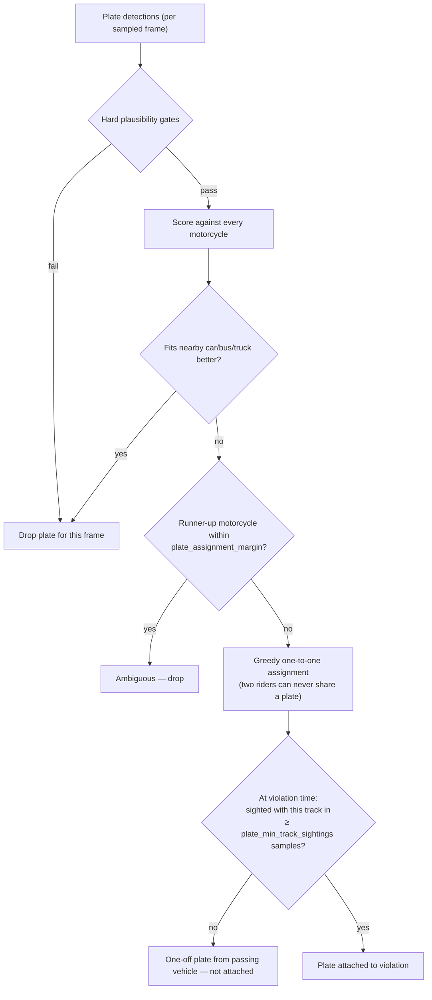

Hard gates: plate center inside the expanded motorcycle box in the lower region, plausible area ratio, near-square aspect ratio (`plate_min_aspect` 0.55 – `plate_max_aspect` 2.0, tuned for Thai motorcycle plates vs much wider car plates), horizontal offset ≤ `plate_horizontal_slop` (0.22) of the motorcycle width.

### 7.5 Passengers and multi-rider motorcycles

Helmet boxes are assigned to people one-to-one (greedy, by geometric score). On two-up motorcycles the driver's and passenger's heads sit close together; without exclusive assignment both person boxes could claim the driver's helmet and the passenger's own no-helmet box would be orphaned or mislabeled. With one-to-one assignment each rider contributes their own helmet-status vote to the shared motorcycle track, so a helmeted driver with an unhelmeted passenger still produces a violation (the vote rule tolerates mixed tracks).

### 7.6 Adaptive sampling

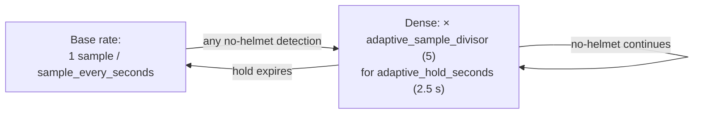

Two purposes: short-lived riders (visible 1–2 s) accumulate enough helmet votes and plate sightings to be saved, and fast bikes displace little enough between dense samples for the tracker to hold identity. The cost is paid only around candidate violations. Disable with `ADAPTIVE_SAMPLING=false`.

### 7.7 Rider identity tracking and helmet voting

The ByteTrack-style tracker (`byte_tracker.py`) runs on **raw motorcycle detections**, not on gated rider associations — motorcycle boxes are the most stable detection in traffic scenes, so identities survive frames where the helmet model or association gates flicker. High-confidence detections match first; unmatched tracks get a second chance against lower-confidence detections.

Matching blends two cues:

- **Kalman motion** — per-track constant-velocity filter over (cx, cy, w, h) whose transition step uses the actual frame gap between sampled updates, so predictions stay meaningful under irregular adaptive sampling. Noise scales with box height, ByteTrack-style.
- **Appearance** — each motorcycle detection carries an HSV color-histogram feature of its crop; tracks keep an EMA of their feature, and the match score blends motion with appearance similarity (`tracker_appearance_weight` 0.30). Appearance rescues weak motion matches on fast riders; a small motion floor prevents identity jumps across the frame between similar-looking bikes.

Track IDs propagate onto rider associations; each sampled association records a helmet-status vote for its track. A no-helmet violation becomes eligible only when the track has:

- at least `min_no_helmet_votes` (2) no-helmet observations, **and**
- `no_helmet × 2 ≥ with_helmet` (no-helmet votes not drowned out).

This suppresses single-frame helmet-model flickers on helmeted riders while letting genuinely mixed tracks (helmeted driver, unhelmeted passenger) through to human review. Stable `track_id` values are written into detection metadata, evidence annotations, saved violations, the review modal, and CSV exports.

**Duplicate suppression** is per-job: track-identity cooldown (`violation_cooldown_seconds` 4) plus a spatial rule — a violation whose motorcycle box overlaps (IoU ≥ 0.35) or lies within one bike-size of a violation saved within the cooldown window is skipped regardless of track id, so tracker churn on one motorcycle cannot double-save. Suppressed saves still extend the dedup chain for moving riders.

## 8. OCR Design

Plate reading lives in `backend/app/services/plate_ocr.py`, specializing EasyOCR for Thai plates:

- The recognizer is restricted to an **allowlist of Thai characters and Arabic digits** — Latin junk reads ("allo", "1o") are impossible by construction.
- OCR lines are classified by shape (registration prefix / digit group / province) and recombined top-to-bottom; a plate-format quality score ranks readings across three preprocess variants (raw, upscaled, adaptive-threshold).
- Across a rider's track, readings are **voted per character position**, weighted by confidence: "1กข 1234" read four times beats "1กข 1284" read once.

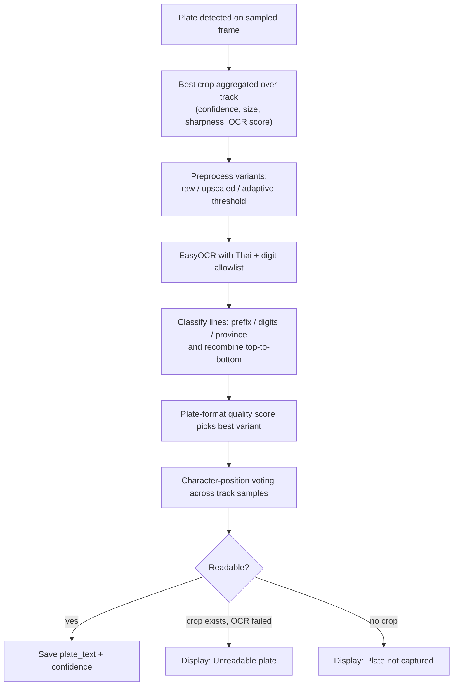

`read_plate_text` is re-exported from `pipeline.py` so `scripts/backfill_plate_ocr.py` (re-running OCR over saved crops) keeps working. On the benchmark clip, the dedicated module lifted OCR confidences from 0.25–0.28 to 0.42–0.56.

## 9. Frontend Playback, Overlays, Telemetry

### Playback and overlays

The Analysis Console and Replay pages use native browser video playback with a canvas overlay:

```text
<video src={source_video}>          ← original upload plays directly (smooth)
<canvas class="detection-overlay">  ← boxes drawn at sampled-frame cadence
```

The frontend polls `GET /api/jobs/{id}/detections` while analysis is active. For each video timestamp it picks the nearest sampled detection frame and draws person, motorcycle, helmet, no-helmet, and plate boxes, association guide lines, and no-helmet rider track labels. The video/canvas stage sizes itself from the actual media aspect ratio (portrait clips render correctly). The Live Monitor uses the MJPEG stream instead, since frames are annotated server-side in real time.

### Telemetry

Persisted per job in SQLite, refreshed by polling: progress %, current/total/sampled frames, violation count, elapsed seconds, processing FPS, ETA seconds, result state.

- `processing_fps` = processed frames ÷ elapsed processing time — true hardware throughput (real-time pacing removed 2026-07-03).
- `eta_seconds` = remaining frames ÷ current processing FPS.

Full formulas in [telemetry-calculation.md](telemetry-calculation.md).

## 10. Model Training (Fine-Tuning)

The baseline helmet/plate models are generic Hugging Face weights never trained on Thai traffic footage. Two fine-tuning rounds have been completed in the isolated `training/` workspace (full reports: [model-training.md](model-training.md), [model-training-round2.md](model-training-round2.md)).

### 10.1 The training loop

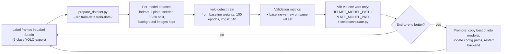

Key design choices:

- **Isolation** — datasets and runs live under `training/`; the running app is untouched until weights are explicitly promoted. A/B testing needs only env vars (pydantic settings map `HELMET_MODEL_PATH` / `PLATE_MODEL_PATH`).
- **Drop-in class names** — the helmet dataset uses `with helmet` / `without helmet` so trained weights swap in with no pipeline code changes.
- **Unused labels by design** — Motorcycle (COCO YOLO11s already supplies it plus person/car/bus/truck context the dataset lacks — why a unified 5-class model can't replace the 3-model structure) and No License Plate (no pipeline feature yet).
- **Each round retrains from the original baseline**, not the previous round's checkpoint, to avoid compounding overfit.

### 10.2 Datasets

| Round | Export(s) | Frames | Split | Helmet boxes (with / without) | Plate boxes |
|---|---|---|---|---|---|
| 1 (2026-07-11) | `train-data/` | 111 | 89 / 22 | 182 / 99 | 202 |
| 2 (2026-07-15) | `train-data/` + `train-data2/` | 325 | 260 / 65 | 547 / 246 | 587 |

`prepare_dataset.py` accepts multiple `--src` folders and fails loudly on duplicate filenames across exports. Frames without a model's classes are kept as background images (empty label files).

### 10.3 Results — production baseline vs fine-tuned v2

Both validated on the identical 65-image held-out split (neither trained on those frames):

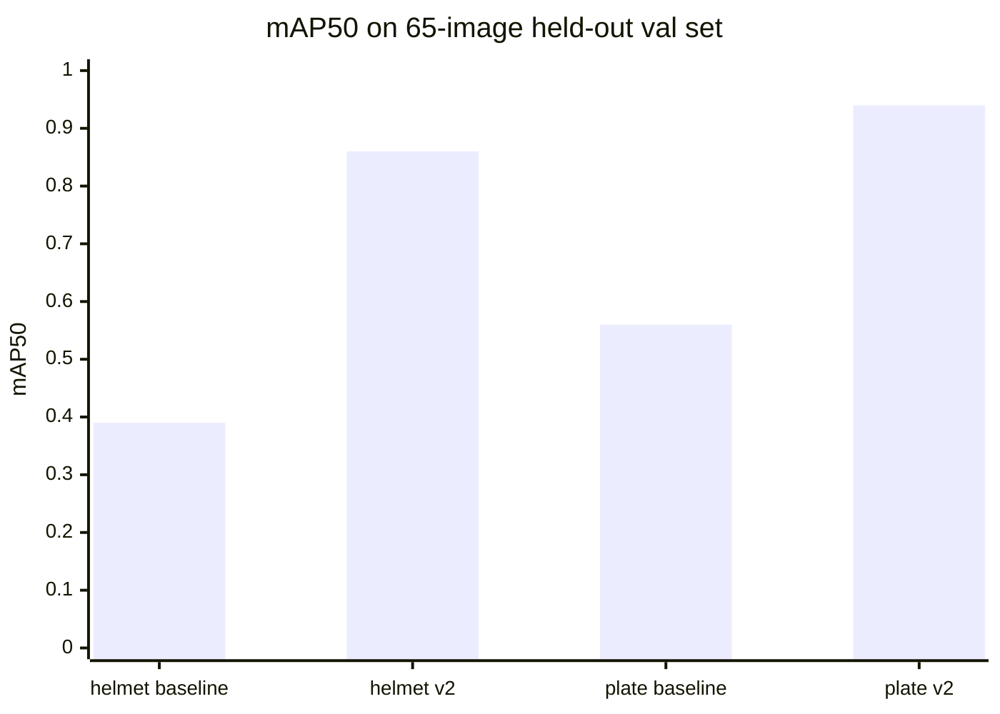

| Model | Precision | Recall | mAP50 | mAP50-95 |
|---|---|---|---|---|
| helmet **production** | 0.52 | 0.46 | 0.39 | 0.15 |
| helmet **v2** | **0.84** | **0.82** | **0.86** | **0.38** |
| plate **production** | 0.58 | 0.70 | 0.56 | 0.26 |
| plate **v2** | **0.93** | **0.83** | **0.94** | **0.50** |

- Helmet quality more than doubles (mAP50 0.39 → 0.86); "Without Helmet" — the class that triggers violations — improves AP50 0.33 → 0.89.
- Plate precision 0.58 → 0.93: far fewer junk crops entering OCR.

**Status: v2 weights are staged at `training/runs/{helmet,plate}-v2/weights/best.pt` but not yet promoted.** The promotion gate is the end-to-end A/B with `scripts/evaluate.py` (detector metrics say nothing about violation events, duplicates, or OCR accuracy). After promotion, re-tune `HELMET_CONFIDENCE` / `PLATE_CONFIDENCE` — at 2× detector mAP the confidence distributions have shifted. Known blind spots: night, rain, unseen angles.

Windows training gotchas learned: `workers=0` fixes the PyTorch DataLoader multiprocessing crash if it appears; any script calling ultralytics needs an `if __name__ == "__main__":` guard or Windows `spawn` re-imports it in a loop.

## 11. Evaluation

Two measurement tools exist so threshold and pipeline changes are validated instead of guessed:

### Offline eval harness — `scripts/evaluate.py`

Runs labeled clips through the **real** pipeline and reports event-level precision, recall, duplicate rate, plate capture rate, and OCR exact-match rate.

```powershell
python scripts/evaluate.py scripts/eval-labels.example.json
python scripts/evaluate.py my-labels.json --json results.json --keep-jobs
```

The labels file lists clips with frame ranges of real no-helmet riders (optionally plate text). Clips with an empty event list measure false positives on clean footage. Eval jobs run through the normal database and are deleted afterwards unless `--keep-jobs`. Detection settings come from config/env, so threshold sweeps use environment variables.

Benchmark clip (62 s) history: 91% precision / 83% recall (5/6 events) on GPU, all saved records distinct riders, zero duplicates.

### Review-decision metrics — `GET /api/metrics/review`

Turns the human decisions already collected on the Violations page into live precision metrics — overall, per job, and per helmet-confidence band. Confirmed/false-positive counts also identify which evidence images are worth exporting as fine-tuning data.

## 12. Configuration Reference

All settings live in `backend/app/core/config.py` (pydantic `BaseSettings`); every field is overridable via `.env` or environment variable of the same name uppercased (e.g. `helmet_confidence` → `HELMET_CONFIDENCE`).

### Paths and models

| Setting | Default | Purpose |
|---|---|---|
| `object_model_path` | `models/yolo11s.pt` | COCO object detector |
| `helmet_model_path` | `models/helmet-yolov8n.pt` | Helmet detector |
| `plate_model_path` | `models/license-plate-yolo11n.pt` | Plate detector |
| `database_path` | `database/saferide.db` | SQLite file |
| `data_dir` / `cache_dir` | `data/` / `.cache/` | Media roots, model/OCR caches |

### Sampling and pacing

| Setting | Default | Purpose |
|---|---|---|
| `sample_every_seconds` | 1 | Base sampling interval |
| `adaptive_sampling` | true | Densify after no-helmet detections |
| `adaptive_sample_divisor` | 5 | Dense-mode multiplier |
| `adaptive_hold_seconds` | 2.5 | Dense-mode hold (rolling) |
| `realtime_preview` | false | Pace to real time even without viewers |
| `live_preview_fps` | 12 | MJPEG publish rate |
| `metadata_write_seconds` | 1.0 | Detection-JSON write batching |
| `preview_every_samples` | 1 | Preview image cadence |
| `live_max_seconds` | 900 | Live session safety limit |

### Inference

| Setting | Default | Purpose |
|---|---|---|
| `model_device` | `auto` | `auto` → CUDA (FP16) / MPS / CPU |
| `object_confidence` / `helmet_confidence` / `plate_confidence` | 0.35 / 0.35 / 0.30 | Detector thresholds (runtime-tunable) |
| `object_imgsz` / `helmet_imgsz` / `plate_imgsz` | 960 | Inference resolutions |
| `helmet_crop_inference` | true | Rider-crop helmet inference |
| `helmet_crop_imgsz` | 640 | Crop-mode resolution |

### Association gates

| Setting | Default | Purpose |
|---|---|---|
| `min_helmet_person_score` | 0.24 | Helmet ↔ person link gate |
| `min_person_motorcycle_score` | 0.18 | Person ↔ motorcycle link gate |
| `min_helmet_motorcycle_score` | 0.30 | Helmet ↔ motorcycle link gate |
| `min_no_helmet_association_score` | 0.38 | Save-time gate for no-helmet riders |
| `min_plate_motorcycle_score` | 0.28 | Plate ↔ motorcycle score gate |
| `min_no_helmet_votes` | 2 | Votes required per track before saving |

### Plate gates

| Setting | Default | Purpose |
|---|---|---|
| `plate_min_aspect` / `plate_max_aspect` | 0.55 / 2.0 | Near-square Thai motorcycle plates |
| `plate_horizontal_slop` | 0.22 | Max horizontal offset (× moto width) |
| `plate_assignment_margin` | 0.04 | Ambiguity margin → drop plate |
| `plate_min_track_sightings` | 2 | Co-travel samples before attach |
| `plate_aggregation_seconds` | 2 | Wait window for a better crop |
| `plate_aggregation_min_samples` | 3 | Min samples in the window |

### Tracker

| Setting | Default | Purpose |
|---|---|---|
| `tracker_high_confidence` | 0.25 | First-pass match threshold |
| `tracker_low_confidence` | 0.10 | Second-chance threshold |
| `tracker_new_track_confidence` | 0.25 | Min confidence to spawn a track |
| `tracker_match_threshold` | 0.25 | Min blended match score |
| `tracker_max_lost_seconds` | 3 | Track memory after last sighting |
| `tracker_appearance_weight` | 0.30 | Appearance vs motion blend |

### Violations and OCR

| Setting | Default | Purpose |
|---|---|---|
| `violation_cooldown_seconds` | 4 | Per-identity save cooldown |
| `max_violations_per_video` | 25 | Per-job cap (runtime-tunable) |
| `enable_ocr` | true | OCR on/off (runtime-tunable) |
| `ocr_languages` | `["th", "en"]` | EasyOCR languages |
| `ocr_gpu` | `None` | `None` = GPU when CUDA exists |

Tuning guidance per setting lives in [confidence-settings.md](confidence-settings.md).

## 13. Error Handling and Cleanup

Failure paths: invalid upload content type → HTTP 400; missing jobs/violations → HTTP 404; invalid review status → HTTP 400; processing exceptions mark the job `failed` with a message.

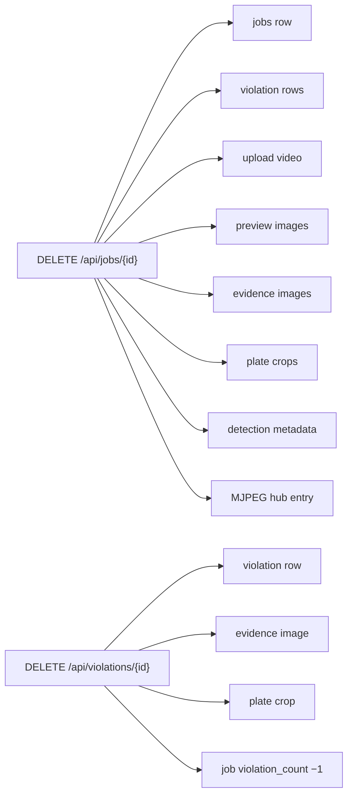

File deletion is restricted to the known media roots under `data/` (`storage.py`) so a corrupted path can never delete outside the sandbox.

## 14. Tradeoffs and Limitations

- **FastAPI background tasks** are simple and demo-friendly but not durable — a job dies silently if the process exits mid-run (no resume).
- **SQLite** suits local single-user work, not concurrent production workloads.
- **Local filesystem media** lacks retention policy, access control, and object-storage semantics.
- **Sampled detection** misses events between samples; with `min_no_helmet_votes = 2`, a rider must appear in ≥ 2 sampled frames — riders crossing in under `2 × sample_every_seconds` are intentionally skipped (precision over recall; adaptive sampling makes this rare). Set `MIN_NO_HELMET_VOTES=1` for single-sample saving.
- **Detection metadata** is a JSON file rewritten in full (batched to 1/s) — fine at current sizes, would need SQLite/streaming if it grows.
- **Runtime settings are not persisted** — they reset on backend restart.
- **Rider identity anchors to motorcycle tracks** — stable, but a rider switching between detected motorcycles under dense occlusion can change identity.
- **Helmet crop inference only looks near motorcycles** — heads away from any motorcycle are not detected (they could never become violations anyway).
- **Live recording codec** falls back to `mp4v` when no H.264 encoder exists; some browsers can't play that inline.
- **Fine-tuned models learned local footage** — night, rain, and unseen camera angles remain unproven.

## 15. Security and Privacy Notes

Current MVP limitations: no authentication, no user roles, no encryption at rest; uploaded videos and evidence stay on local disk until deleted; `/media` serves generated media directly from `data/`; CORS is limited to `localhost:3000`. RTSP credentials are stripped from stored job names, but the RTSP URL itself is used in-process.

For production: authentication + authorization, retention policy, access-controlled media serving, audit logging, and encrypted storage of evidence (which is personal data — faces and plates).

## 16. Future Work

1. **Promote the v2 fine-tuned weights** after the end-to-end A/B (`scripts/evaluate.py`), then re-tune confidence thresholds.
2. **Round 3 labeling**: night, rain, new angles — the current blind spots.
3. Persist runtime settings or add named tuning presets.
4. Surface `/api/metrics/review` in the frontend as an accuracy dashboard.
5. Timeline markers for violations on replay playback.
6. Confirmed/false-positive evidence export as fine-tuning data (closing the review → training loop).
7. "Rider with no plate" violation type (the No License Plate labels already exist).
8. Train a dedicated Thai plate recognition model (current OCR is allowlisted + voted EasyOCR).
9. Multi-camera live sessions and durable live-job recovery after backend restarts.
10. PDF/HTML report generation.
11. Authentication and production media access control.

## 17. Change History

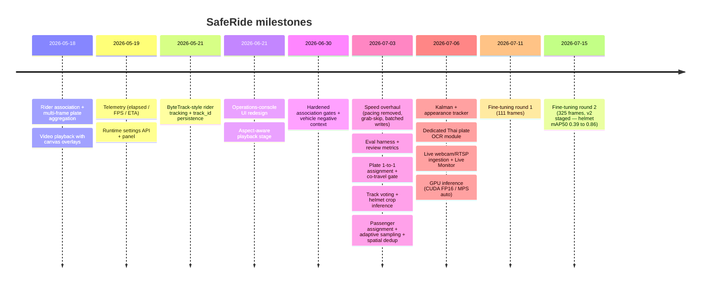

### 2026-07-15 — Fine-tuning round 2

Retrained both specialist models from baseline on 325 combined frames (260/65 split). On the shared 65-image held-out set the v2 helmet model beats production 0.86 vs 0.39 mAP50 and the v2 plate model 0.94 vs 0.56. Weights staged in `training/runs/`, pending end-to-end A/B before promotion. `prepare_dataset.py` gained multi-export support with duplicate-filename detection.

### 2026-07-11 — Fine-tuning round 1

First fine-tune on 111 Label Studio frames; isolated `training/` workflow created (dataset prep, drop-in class names, env-var A/B path). Without-helmet class hit 1.00 precision / 0.90 recall on the (small) 22-image val set. ~15 min total training on the RTX 4070 SUPER.

### 2026-07-06 — Tracker, OCR, live ingestion, GPU

1. Tracker upgraded with dt-aware Kalman motion and HSV-histogram appearance matching; benchmark recall 4/6 → 5/6 events, spawned identities 111 → 64.
2. Plate OCR extracted to `plate_ocr.py`: Thai + digit allowlist, multi-line recombination, character-level cross-sample voting; OCR confidences 0.25–0.28 → 0.42–0.56.
3. Live ingestion (`/api/live/*`, `live.py`, `/live` page): wall-clock sampling, MP4 session recording, MJPEG live stream.
4. GPU support: `model_device=auto` (CUDA FP16 / MPS / CPU), OCR follows CUDA; benchmark clip 27.4 s wall clock at 91% precision / 83% recall.

### 2026-07-03 — Accuracy and speed overhaul (+ field-test fixes)

1. Real-time pacing removed by default; `grab()` frame skipping; metadata writes batched; MJPEG encoding skipped without viewers. Benchmark: 62.0 s → 26.3 s (CPU), saved records 16 → 3 with zero duplicates.
2. Eval harness (`scripts/evaluate.py`) and `GET /api/metrics/review` added.
3. Plate association: near-square aspect gate, tighter slop, one-to-one greedy assignment with ambiguity margin, temporal co-travel gate.
4. Tracker moved to raw motorcycle detections; per-track helmet voting (`min_no_helmet_votes`).
5. Helmet inference moved to batched rider crops.
6. OCR multi-line recombination, format-quality scoring, cross-sample voting.
7. Field-test fixes: one-to-one helmet→person assignment (passengers), adaptive sampling (short-lived riders), spatial duplicate suppression (tracker churn), evidence-modal `position: fixed` containing-block fix (opacity-only page animation).

Earlier milestones (association scoring, plate aggregation, overlay playback, telemetry, runtime settings, ByteTrack integration, UI polish) are detailed in [progresslog.md](../progresslog.md).
